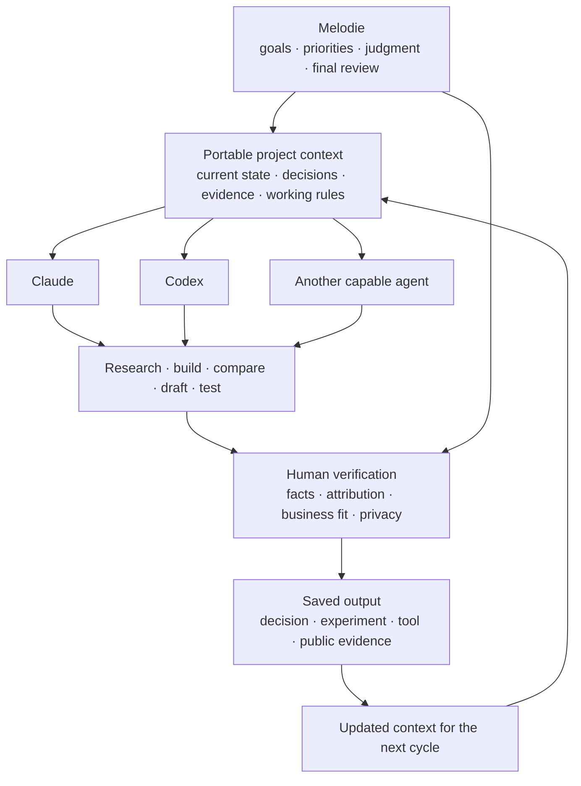

# MelodieOS — how I work with AI over time

Most AI use starts and ends with a task: write this, summarize that, build this feature. My work rarely fits inside one conversation. Growth decisions develop across market research, experiments, partner conversations and review cycles, often over weeks or months.

I built MelodieOS so that this work does not depend on one chat history—or one AI agent remembering me.

MelodieOS is my private, agent-agnostic working system. It gives Claude, Codex or another capable agent enough shared context to enter an ongoing project, understand its current state, work within explicit boundaries and leave behind something the next agent can continue. I still own the goal, the facts, the business judgment and the final review.

This page explains the operating practice. The private notes, dashboards and personal data behind it are not public.

## The problem it solves

Without a durable working system, AI collaboration kept breaking in predictable ways:

- I had to explain the same context again in every new conversation.
- useful decisions disappeared inside chat histories;
- an agent could complete the immediate task while missing the longer-term goal;
- research, learning and execution accumulated in separate places;
- confident output could still contain a weak assumption, stale fact or incorrect attribution.

The problem was not access to intelligence. It was continuity, direction and control.

**Before → After:** isolated prompts → shared project context → clear delegation → human verification → saved work → a better starting point for the next cycle.

## A human-led orchestration layer

The agents are replaceable. The context and decision history belong to me.

This is not an autonomous multi-agent platform. It is a human-led orchestration practice: I decide what work matters, what an agent may handle, what evidence is required and when an output is good enough to use.

## Five operating loops

The private system contains several workstreams, but they serve five jobs rather than existing as a collection of folders.

| Loop | Question it answers | What changes |
|---|---|---|
| **Direction** | What matters now, given the long-term goal and real constraints? | Too many parallel intentions become a small set of explicit priorities. |
| **Intelligence** | Which signals should change my view of a market, company, user or partner? | Reading and saved links become a judgment, an action or a decision not to act. |
| **Growth execution** | What does the market appear to value, and can I test it in real work? | Job-market signals become a growth hypothesis, an experiment and—only when earned—public evidence. |
| **Leadership and influence** | How should a decision move through people, partnerships and communication? | Private analysis becomes a clear proposal, conversation or next action. |
| **Sustainable capacity** | What can be executed with the time, energy and resources actually available? | Plans are constrained by reality instead of assuming unlimited personal capacity. |

Behind those loops are private systems for priorities, concepts, career-market research, AI work, relationships, market intelligence, growth experiments, bilingual communication, company and historical analysis, personal capacity, financial constraints and management learning. I expose the operating logic, not the underlying personal records.

## One loop in practice: market demand to public proof

My current portfolio is one end-to-end example.

1. **Sense the market.** I compared two AI-growth job descriptions and separated repeated requirements from one-company preferences.
2. **Frame the work.** The repeated need was not “produce more AI content.” It was to connect market sensing, distribution, experiments, activation and measurable business outcomes.
3. **Retrieve existing evidence.** I reviewed prior growth work and current tools against that operating model.
4. **Delegate execution.** Codex inspected source material, reorganized the public repository and implemented the changes. External examples and a second model were used to challenge the presentation.
5. **Verify the claims.** I separated career outcomes from tool outputs, corrected attribution boundaries and checked the underlying archive rather than trusting a written summary. The published KOL figure—**197 account archives and 11,100 posts**—was verified from the saved files.
6. **Reject weak evidence.** When a generated image altered a real product screenshot during redaction, I rejected it as documentary evidence and used a deterministic privacy edit instead.
7. **Publish and update the system.** The result became this public portfolio; the decisions and failures became context for the next agent and the next review cycle.

The output was not just a rewritten README. The cycle also improved the way later work is briefed, checked and published.

## What I delegate—and what I retain

| AI can help with | I remain responsible for |
|---|---|
| Search and comparison | Choosing the problem |
| Repetitive processing | Setting priorities |
| Drafting and implementation | Business logic and trade-offs |
| Code and workflow construction | Source quality and factual accuracy |
| Pattern discovery | Causal attribution |
| Maintaining project state | Privacy and disclosure boundaries |
| Producing candidate answers | Final acceptance or rejection |

This separation lets me work beyond my individual execution capacity without pretending that an AI-generated answer is automatically a sound decision.

## Why this matters for growth leadership

A growth leader works across incomplete information, competing priorities, multiple functions and constant feedback. The job is not to personally execute every task. It is to keep the team pointed at the right problem, make evidence visible, assign work intelligently and turn results into a better next decision.

MelodieOS is where I practise that operating model on myself. Its next application is role-level growth work: a shared system in which market signals, user feedback, experiments, partner decisions and results remain usable across people and AI agents—not trapped in one person's memory or one model's conversation history.

**Demonstrated now:** a private system used across ongoing real work, with multiple agents, persistent context, explicit handoffs and human review.

**Next application:** a Growth OS that helps a team sense opportunities, run experiments, retain decisions and improve execution over time.

## Privacy boundary

MelodieOS is private by design. This public case does not include its source Markdown, directory tree, personal dashboard, model memories, relationship records, employer material, health or financial data, paid course content or private research archives.

What is public is the part relevant to evaluating my work: the problem, the operating logic, the division of responsibility, a verifiable example and the boundary between what exists today and what I intend to apply next.
